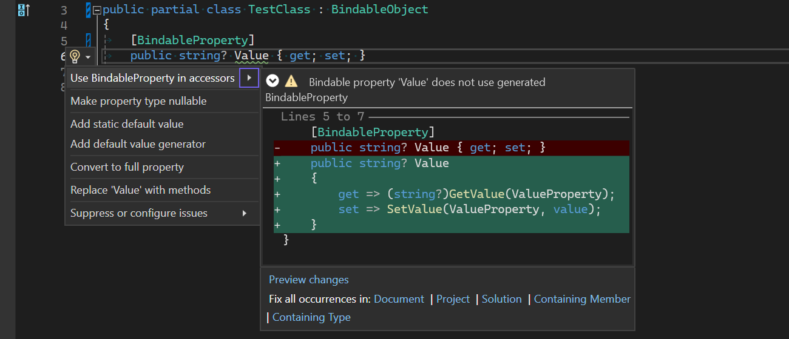
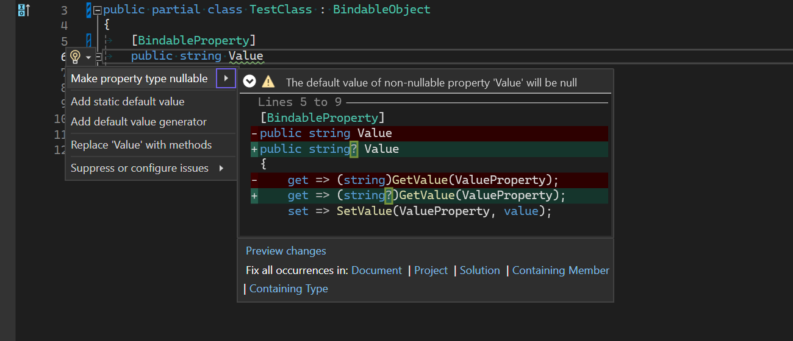
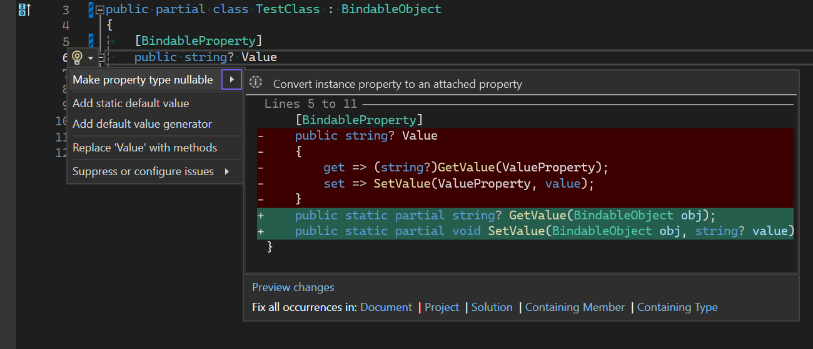
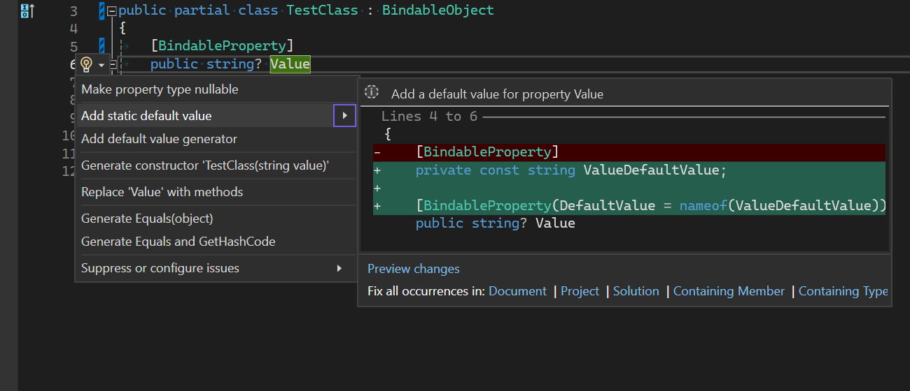

# Pick.Net.Utilites.Maui
Various helper classes and source generators for .NET MAUI.

### Bindable Property Generation
This package includes a roslyn source generator that can generate backing BindableProperty fields for properties automatically, using the `[BindableProperty]` attribute.
```csharp
public partial class TestClass : BindableObject
{
	private const string DefaultValue = "default";

	[BindableProperty(DefaultMode = BindingMode.TwoWay, DefaultValue = nameof(DefaultValue))]
	public string Value
	{
		get => (string)GetValue(ValueProperty);
		set => SetValue(ValueProperty, value);
	}
}
```
This will generate a BindableProperty field with the same access modifier as the property.
```csharp
#nullable enable
partial class TestClass
{
	partial void OnValueChanging(string oldValue, string newValue);

	partial void OnValueChanged(string oldValue, string newValue);

	/// <summary>Bindable property for <see cref="Value"/>.</summary>
	public static readonly global::Microsoft.Maui.Controls.BindableProperty ValueProperty = global::Microsoft.Maui.Controls.BindableProperty.Create(
		"Value",
		typeof(string),
		typeof(global::TestClass),
		ValueDefaultValue,
		global::Microsoft.Maui.Controls.BindingMode.TwoWay,
		null,
		(bindable, oldValue, newValue) => ((global::TestClass)bindable).OnValueChanging((string)oldValue, (string)newValue),
		(bindable, oldValue, newValue) => ((global::TestClass)bindable).OnValueChanged((string)oldValue, (string)newValue),
		null,
		null);
}
```

You can generate a read-only property by adding an access modifier to the property setter.
```csharp
[BindableProperty]
public string Value
{
	get => (string)GetValue(ValueProperty);
	private set => SetValue(ValuePropertyKey, value);
}
```
This will generate a BindablePropertyKey field with the same access modifier as the setter, and a property key field.

```csharp
partial void OnValueChanging(string oldValue, string newValue);

partial void OnValueChanged(string oldValue, string newValue);

/// <summary>Bindable property key for <see cref="Value"/>.</summary>
private static readonly global::Microsoft.Maui.Controls.BindablePropertyKey ValuePropertyKey = global::Microsoft.Maui.Controls.BindableProperty.CreateReadOnly(
	"Value",
	typeof(string),
	typeof(global::Pick.Net.Utilities.Maui.TestApp.Controls.TestClass),
	null,
	global::Microsoft.Maui.Controls.BindingMode.OneWay,
	null,
	(bindable, oldValue, newValue) => ((global::Pick.Net.Utilities.Maui.TestApp.Controls.TestClass)bindable).OnValueChanging((string)oldValue, (string)newValue),
	(bindable, oldValue, newValue) => ((global::Pick.Net.Utilities.Maui.TestApp.Controls.TestClass)bindable).OnValueChanged((string)oldValue, (string)newValue),
	null,
	null);

/// <summary>Bindable property for <see cref="Value"/>.</summary>
public static readonly global::Microsoft.Maui.Controls.BindableProperty ValueProperty = ValuePropertyKey.BindableProperty;
```
You can also use the attribute on methods to generate attached bindable properties.
```csharp
[BindableProperty]
public static partial string GetValue(Element element);

private static partial string SetValue(Element element, string value);
```
This generates the following code:
```csharp
static partial void OnValueChanging(global::Microsoft.Maui.Controls.Element bindable, string oldValue, string newValue);

static partial void OnValueChanged(global::Microsoft.Maui.Controls.Element bindable, string oldValue, string newValue);

/// <summary>Bindable property key for the attached property <c>Value</c>.</summary>
private static readonly global::Microsoft.Maui.Controls.BindablePropertyKey ValuePropertyKey = global::Microsoft.Maui.Controls.BindableProperty.CreateAttachedReadOnly(
	"Value",
	typeof(string),
	typeof(global::Pick.Net.Utilities.Maui.TestApp.Controls.TestClass),
	null,
	global::Microsoft.Maui.Controls.BindingMode.OneWay,
	null,
	(bindable, oldValue, newValue) => OnValueChanging((global::Microsoft.Maui.Controls.Element)bindable, (string)oldValue, (string)newValue),
	(bindable, oldValue, newValue) => OnValueChanged((global::Microsoft.Maui.Controls.Element)bindable, (string)oldValue, (string)newValue),
	null,
	null);

/// <summary>Bindable property for the attached property <c>Value</c>.</summary>
public static readonly global::Microsoft.Maui.Controls.BindableProperty ValueProperty = ValuePropertyKey.BindableProperty;

public static partial string GetValue(global::Microsoft.Maui.Controls.Element element) 
	=> (string)element.GetValue(ValueProperty);

private static partial void SetValue(global::Microsoft.Maui.Controls.Element element, string value) 
	=> element.SetValue(ValuePropertyKey, value);
```
You can use the properties on the `[BindableProperty]` attribute to set the properties default value, default `BindingMode`, and to use value validator and coerce methods.

There are also code fixers to help speed up development:








